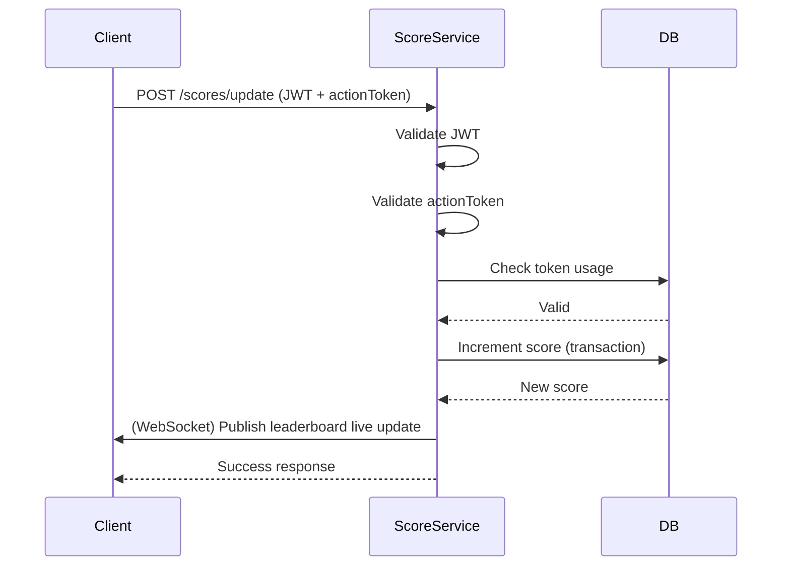

# Tech 99 Challenge

Created time: December 14, 2025 6:07 PM
Last edited time: December 14, 2025 10:12 PM

# Score Board API Service

## Overview

This document specifies the **Score Board API Service**, a backend module responsible for:

- Maintaining user scores
- Providing the **top 10 leaderboard**
- Supporting **near real-time (live) updates**
- Prevent **unauthorized or malicious score manipulation**

## Goals

- Securely update user scores after a valid action
- Provide live leaderboard updates to connected clients
- Ensure data integrity and audibility

## Limitation

- Defining what the user action is
- Frontend UI implementation
- Anti-cheat logic beyond API-level validation

## Technical Decision

**Clients** interact with the Score Service to:

- Submit score updates after completing an action
- Subscribe to live leaderboard updates

The Score Service:

- Validates requests
- (WebSocket) Publishes leaderboard changes
- Updates scores transactionally

## Possible Risk

| Possible Threat                   | Prevention                    | Notes                       |
| --------------------------------- | ----------------------------- | --------------------------- |
| Forged requests                   | JWT authentication            |                             |
| Replay attacks                    | Single-use action tokens      | - HMAC-signed action tokens |
| - Token storage in Redis with TTL |
| Automated abuse                   | Rate limiting per user        |                             |
| Score tampering                   | Server-side score calculation |                             |

## Resource

entity: `users`

| Field | Type        | Notes   |
| ----- | ----------- | ------- |
| id    | varchar(36) | UUID v4 |
| score | int         |         |

entity: `action_tokens`

| Field      | Type          | Notes |
| ---------- | ------------- | ----- |
| token      | varchar(255)  |       |
| user_id    | varchar(36)   |       |
| action_id  | varchar(255)  |       |
| expires_at | timestamp ISO |       |
| used_at    | timestamp ISO |       |

## API Specification

### Feature: Submit Score Update

| API Method               | POST                    | -                                                                                                                                                                               |
| ------------------------ | ----------------------- | ------------------------------------------------------------------------------------------------------------------------------------------------------------------------------- |
| **API Method**           | POST                    | -                                                                                                                                                                               |
| **API Path**             | `/api/v1/scores/update` | -                                                                                                                                                                               |
| **Request Header**       | `Authorization`         | Type: String Example: `Bearer <access_token>`                                                                                                                                |
| **Request Params**       | -                       | -                                                                                                                                                                               |
| **Request Query Params** | -                       | -                                                                                                                                                                               |
| **Request Body**         | `actionId`              | Type: String                                                                                                                                                                    |
|                          | `actionToken`           | Type: String Generated by the server when the action is initiated. Token is: • Single-use • Short-lived (e.g., 30–60 seconds) • Bound to `userId` and `actionId` |
| **Success Response**     | Status Code             | `200`                                                                                                                                                                           |
|                          | `previousScore`         | Type: Integer                                                                                                                                                                   |
|                          | `newScore`              | Type: Integer                                                                                                                                                                   |
| **Failed Response**      | `401 Unauthorized`      | Invalid or missing JWT                                                                                                                                                          |
|                          | `403 Forbidden`         | Invalid or reused action token                                                                                                                                                  |
|                          | `409 Conflict`          | Duplicate submission (idempotency violation)                                                                                                                                    |

### Feature: Get Top 10 Leaderboard

| Category                 | Field                       | Description                                      |
| ------------------------ | --------------------------- | ------------------------------------------------ |
| **API Method**           | GET                         | -                                                |
| **API Path**             | `/api/v1/leaderboard/top`   | -                                                |
| **Request Header**       | `Authorization`             | Type: String Example: `Bearer <access_token>` |
| **Request Params**       | -                           | -                                                |
| **Request Query Params** | -                           | -                                                |
| **Request Body**         | -                           | -                                                |
| **Success Response**     | Status Code                 | `200`                                            |
|                          | `leaderboard`               | Array of objects containing `userId` and `score` |
| **Failed Response**      | `500 Internal Server Error` | Server error                                     |

### Feature: Live Leaderboard Updates

**Implementation:** WebSocket

**Server pushes updates when:**

- Top 10 changes
- Score of an existing top 10 user changes

| Category                 | Field                        | Description                                      |
| ------------------------ | ---------------------------- | ------------------------------------------------ |
| **Protocol**             | WebSocket                    | -                                                |
| **API Path**             | `/api/v1/leaderboard/stream` | -                                                |
| **Request Header**       | `Authorization`              | Type: String Example: `Bearer <access_token>` |
| **Request Params**       | -                            | -                                                |
| **Request Query Params** | -                            | -                                                |
| **Event Payload**        | `type`                       | `LEADERBOARD_UPDATED`                            |
|                          | `data.userId`                | Type: String                                     |
|                          | `data.score`                 | Type: Integer                                    |
|                          | `data.rank`                  | Type: Integer (1-10)                             |
| **Connection**           | Established                  | WebSocket connection opened                      |
| **Failed Response**      | `401 Unauthorized`           | Invalid or missing JWT                           |
|                          | Connection Closed            | Server terminates connection                     |

## Suggested Improvements & Future Enhancements

<aside>
💡

These are not required for initial implementation, but recommended.

</aside>

1. **Event-Driven Architecture**
   - Emit `ScoreUpdated` domain events
   - Allow other services (rewards, achievements) to subscribe
2. **Cheat Detection Layer**
   - Anomaly detection on score increments
3. **Horizontal Scalability**
   - Stateless API servers
   - Redis-backed WebSocket adapter
4. **Idempotency Keys**
   - Allow safe retries for clients
5. **Read Replicas**
   - Offload leaderboard reads
